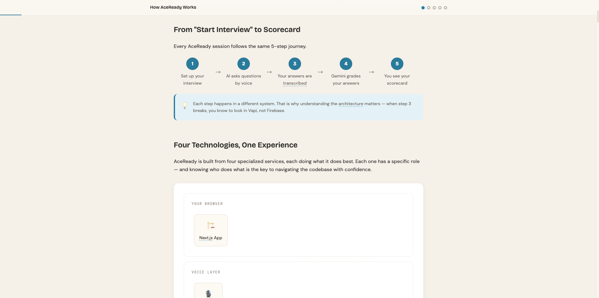

    
  <h1>AceReady Interactive Architecture Walkthrough</h1>
  
A 5-module interactive walkthrough of how AceReady works under the hood

  <a href="https://lorrainec26.github.io/AceReady-architecture-walkthrough/"><strong>View Walkthrough</strong></a>
  &nbsp;·&nbsp;
  <a href="https://github.com/lorraineC26/ai-mock-interview-platform">Main AceReady Repo</a>

  
  
  
  
  
  

  <!-- 
  
   -->

---

## What This Is

This is a standalone interactive walkthrough of the architecture of [AceReady](https://github.com/lorraineC26/ai-mock-interview-platform) — an AI-powered mock interview platform built with **Next.js, Firebase, Vapi, and Google Gemini**.

Each module uses real code from the AceReady codebase, paired with diagrams, animations, and quizzes to explain how the pieces connect. No prior knowledge of the tech stack required.

**Open `index.html` in your browser to get started. No build step, no dependencies.**

---

## Modules

| # | Title | What You'll Learn |
|---|-------|-------------------|
| 1 | **Meet AceReady** | The end-to-end user journey and how 4 services chain together into one experience |
| 2 | **The Cast of Characters** | The role of each technology: Next.js, Firebase, Vapi, and Gemini |
| 3 | **Getting You In the Door** | How authentication works — Firebase Auth, session cookies, and server-side identity checks |
| 4 | **Your Voice, Live on the Wire** | How Vapi streams voice in real time, fires events, and builds the interview transcript |
| 5 | **The AI That Grades You** | How Gemini generates interview questions and produces structured feedback from a transcript |

---

## Interactive Elements

Each module includes a combination of:

- **Flow diagrams** — step-by-step visual walkthroughs of how data moves
- **Group chat animations** — services "talking" to each other to illustrate request/response flows
- **Code ↔ English translations** — real code from the codebase, explained line by line in plain language
- **Pattern cards** — concise summaries of states, technologies, or scoring categories
- **Quizzes** — scenario-based questions to test your understanding
- **Callout boxes** — key concepts like httpOnly cookies, the Observer pattern, and upsert logic
- **Glossary tooltips** — hover over technical terms to see plain-language definitions

---

## How to Use

1. Clone or download this repository
2. Open `index.html` in any modern browser
3. Work through the modules in order — each one builds on the last

No internet connection required after loading (all assets are self-contained).

---

## Relationship to the Main Repo

This walkthrough was originally part of the [AceReady](https://github.com/lorraineC26/ai-mock-interview-platform) repository and was moved here to keep the main repo clean.

All code snippets reference the actual source files in the main repo. If you want to follow along in the code, clone both repos side by side.
